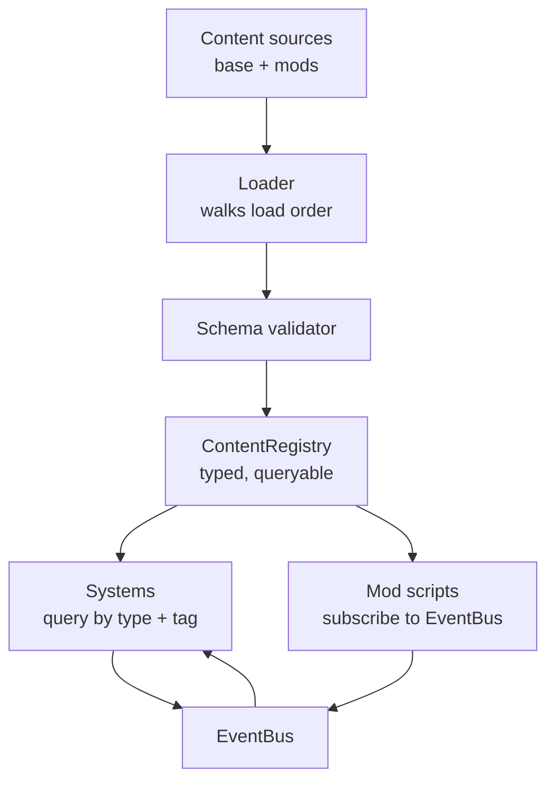

# 02 · Architecture

[← Vision](01-vision.md) · [Index](README.md) · [Next: Loop A →](03-loop-a-floor.md)

> **Load-bearing.** Nothing in documents 03–08 may be built until the skeleton described
> here passes its tests. A shortcut taken in this document is discovered at 80% completion.

---

## The rule that governs everything

**The base game is the first mod.**

All shipped content loads through the same registry, schema and loader that a third-party
mod will use. [`content/`](../../content/) has a manifest, definitions and schemas identical
in form to any community mod, and holds no privileges.

If the base game has a privileged path, the modding system is decorative. See
[ADR-0005](../decisions/0005-base-game-ships-as-a-mod.md).

## Engine and stack

Godot 4.7.2, GDScript, Forward+ renderer. Pinned in [`.godot-version`](../../.godot-version);
CI uses the matching container. Do not track dev snapshots. The reasoning, including what
Unity would have done better, is in [ADR-0001](../decisions/0001-engine-godot.md).

| Layer | Choice | Constraint |
| --- | --- | --- |
| Engine | Godot 4.7.2 stable | Exact version in `.godot-version` |
| Language | GDScript | **Static typing mandatory.** Every variable, parameter and return annotated. `class_name` on every script. No untyped `var`. |
| Native code | GDExtension via godot-rust, reserved | Only for a measured hot path. Expect to need none. |
| Renderer | Forward+ | Baked `LightmapGI`, SDFGI off, screen-space reflections off by default |
| Physics | Jolt (engine default) | Layer masks defined as named constants in one file |
| Networking | `ENetMultiplayerPeer`, host-authoritative | Wrapped behind a `NetTransport` interface so Steam Sockets can drop in later without touching game code |
| Data | JSON as source of truth, parsed into `Resource` instances at load | Modders must never need the Godot editor to add content |
| Tests | gdUnit4 | Unit + headless integration; see [13](13-testing-and-verification.md) |
| CI | GitHub Actions, headless Godot container | Every commit: import, lint, test, export Linux + Windows |
| Targets | Linux and Windows desktop for v1 | macOS best-effort. No console, no mobile, no web. |

### Hard rules

- **Never commit a binary `.tscn` or `.res`.** Text formats only, so every diff is reviewable.
- **Never store a hardcoded game value in a script.** If a designer or modder might want to
  change it, it lives in JSON.
- `.gitattributes` marks `*.tscn`, `*.tres`, `*.godot` as text with LF endings.
- The project must open, import cleanly, and pass the full test suite on a machine that has
  only the pinned Godot binary and the repository.

## The central idea: a typed content registry

Every noun in the game — a product, a customer archetype, a document type, a verification
rule, a tool, a cat breed, a shelf, a staff role, a recipe, a quest — is a **definition**: a JSON
object with an `id`, a `type`, and a schema-validated body.

At boot, the game walks every content source in load order, validates each definition against
its type's schema, and installs it into `ContentRegistry`. Systems then query the registry by
type and tag. **No system ever names a specific content id in code.**



A system that needs "all products that are age-restricted and refrigerated" asks the registry
for `product` definitions tagged `age_restricted` and `chilled`. A modder who adds a new such
product gets correct behaviour from the fridge system, the ID-check system, the restock
system and the health inspector **without writing a line of code**.

### Definition types in v1

| Type | Governs | Referenced by |
| --- | --- | --- |
| `product` | SKU, category, price band, size, storage class, tags | Shelving, pricing, restock, verification, kitchen |
| `supplier` | Catalogue, lead time, reliability, legitimacy profile | Ordering, delivery verification |
| `customer_archetype` | Appearance pool, behaviour weights, budget, patience | Spawning, AI |
| `document_type` | Field list, layout, security features, forgery vectors | Verification, tool interaction |
| `rule` | A declarative check: field comparison, cross-reference, tool requirement | Verification engine |
| `tool` | Inspection device, what fields it reveals, ergonomics | Counter, unlock tree |
| `fixture` | Shelf, fridge, freezer, grill, register, display case, table | Building, maintenance |
| `cat` | Breed, coat, personality traits, ability | Adoption, pest control, counter assist |
| `recipe` | Kitchen item: components, steps, timing, tolerance | Loop C |
| `staff_role` | Tasks it can perform, error profile, wage band | Hiring, audit |
| `licence` | What it permits, cost, renewal, strike consequences | Progression |
| `event` | Scripted or random occurrence with trigger conditions | Director |
| `upgrade` | Node in the progression tree, cost, prerequisites | Progression |
| `board_game` | Library and retail titles: component list, player count, weight, play time | Library, component checks |
| `card_set` | Card pool, pull rates, rarity structure, legality window | Loop D |
| `loc_string` | Localisation entry | Everything |

**Adding a seventeenth type must be a matter of writing a schema file and a handler — not
editing a switch statement.** The registry is generic over type.

Current shipped schemas live in [`content/schemas/`](../../content/schemas/) and are
documented field by field in
[../modding/definition-types.md](../modding/definition-types.md).

## Repository layout

```text
/project.godot
/.godot-version
/addons/                    third-party Godot plugins (gdUnit4)
/core/                      engine-facing code. no game content.
  /registry/                ContentRegistry, schema validator, loader
  /events/                  EventBus, event type definitions
  /modding/                 ModLoader, manifest parser, dependency resolver, sandbox
  /net/                     NetTransport interface, ENet impl, replication helpers
  /save/                    versioned save serialiser + migration chain
  /sim/                     tick scheduler, time-of-day, economy primitives
  /util/                    typed helpers, RNG with seeded streams
/systems/                   game systems. read the registry, emit events.
  /floor/  /counter/  /kitchen/  /case/  /cats/  /staff/  /progression/  /director/
/content/                   THE BASE GAME, AS A MOD
  /manifest.json
  /definitions/             one folder per definition type, JSON
  /schemas/                 JSON Schema per definition type
  /scenes/                  .tscn for fixtures, props, characters
  /assets/                  art + audio, each with a .license.json sidecar
/ui/                        screens, HUD, inspection UI
/tests/
  /unit/  /integration/  /content/    content tests validate every definition
/tools/                     CLI: schema gen, licence audit, mod template scaffold
/docs/                      modding guide, API reference, generated from source
```

Only `content/`, `tools/`, `docs/` and `mods/` exist today. The rest lands in
[Phase 0–1](14-work-order.md).

## The event bus

A single typed publish/subscribe bus is **the only permitted cross-system communication**.
Systems never hold direct references to one another. Every event carries a stable name, a
typed payload, and a `cancellable` flag.

| Kind | Examples | Observers may |
| --- | --- | --- |
| **Notification** | `customer_served`, `shift_ended`, `cat_fed` | Observe only — cannot alter the outcome |
| **Query** | `price_requested`, `patience_modifier_requested` | Contribute values, aggregated deterministically |
| **Cancellable** | `sale_attempted`, `delivery_accepted`, `hire_attempted` | Veto, with a reason string |

**Mod scripts get the same bus, the same event names, and the same veto power that base
systems have.** The bus is versioned: event names and payload shapes are part of the public
mod API and follow the [compatibility policy](../modding/README.md#compatibility-policy).

## Determinism and the tick model

The simulation runs on a **fixed 20 Hz logic tick**, decoupled from render framerate. All
gameplay randomness draws from named, seeded RNG streams (`spawn`, `forgery`, `cat_mood`,
`breakage`) so that **a save plus an input log reproduces a session exactly**.

This is not a nicety. It is what makes the headless integration tests in
[13](13-testing-and-verification.md) possible, and what makes multiplayer desync
debuggable.

## Saves

JSON, versioned, with a forward migration chain (`migrations/001_to_002.gd`). A save records
which mods were active and at which versions.

Loading a save whose mods are missing enters a **degraded mode**: the run opens read-only
with a clear list of what is absent and an option to strip the affected content.
**Never silently drop data, never hard-fail.**

## Definition of done for the skeleton

The skeleton is finished — and content work may begin — when all of the following pass in CI
with no game content beyond the fixtures:

- [ ] A definition of every listed type loads from JSON, validates against its schema, and is
      queryable by type and tag.
- [ ] A deliberately malformed definition fails validation with a message naming the file, the
      JSON path and the violated constraint.
- [ ] A test mod adds a product, overrides a base product, and vetoes a `sale_attempted`
      event — with no engine code changed.
- [ ] Load order and dependency resolution handle a three-mod chain, including a
      missing-dependency and a circular-dependency case.
- [ ] A save round-trips through a version migration without data loss.
- [ ] Two headless peers connect through `NetTransport` and converge.

This is the most important gate in the project. It is worth spending disproportionate time
here, and it is the one most likely to be cut under pressure.
