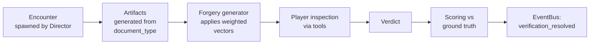

# 04 · Loop B — the counter

[← Loop A](03-loop-a-floor.md) · [Index](README.md) · [Next: Loop C →](05-loop-c-kitchen.md)

> **Weight: primary.** This is the reason the game exists. Design, content and polish effort
> concentrate here and on [Loop C](05-loop-c-kitchen.md).

---

A cafe counter with a bar, a trade-in desk and a card case is a checkpoint that nobody
thinks of as a checkpoint — and it turns out to be one of the densest verification
environments in ordinary life. Age, identity, currency, credentials, receipts, entitlements,
manifests and merchandise all pass across it, and most of them can be faked.

## The verification engine

**All scenario families below run on one generic engine.** This is an
[architecture](02-architecture.md) requirement, not an optimisation.

An encounter presents a set of **artifacts** (an ID, a note, a ticket, a manifest, a card, a
face, a behaviour). A `document_type` definition declares each artifact's fields, layout and
security features. A **forgery generator** perturbs a valid artifact according to weighted
[forgery vectors](#the-three-kinds-of-wrong). A set of `rule` definitions declares the checks
that apply. The player uses `tool` definitions to reveal fields, then renders a verdict. The
engine scores the verdict against ground truth and emits `verification_resolved` on the bus.

> [!IMPORTANT]
> **The critical design constraint: every forgery must be detectable with the tools the
> player currently owns, or the encounter must be resolvable by refusing.** The game never
> demands a coin flip. When a player cannot tell, the correct play is always available —
> decline and eat the small reputation cost. Uncertainty should feel like a tool gap, never
> like unfairness.
>
> This is enforced mechanically:
> [`tools/validate_content.py`](../../tools/validate_content.py) fails the build if a forgery
> vector appears at a tier where none of its detecting tools is available.

## The scenario families

1. **Age-restricted sales.** The backbone. Bar service, adults-only late hours, age-rated
   titles. Compare date of birth against the in-game date, check expiry, match photo to face,
   validate the issuing jurisdiction's format, look for tampering.
2. **Currency.** Counterfeit notes. Watermark, security thread, colour-shifting ink, raised
   printing, serial plausibility, and the tells of a bleached-and-reprinted lower denomination.
3. **Cards and payments.** Cloned cards, name mismatch against ID, declined-then-"try it
   again", chip-disabled swipe insistence, and the distraction patter that accompanies all three.
4. **Entitlement reconciliation.** Store credit with category restrictions, tax-exempt
   certificates from schools and libraries, and organised-play promo kits distributed against
   a participant list. Basket reconciled against entitlement, line by line. See
   [entitlements](#entitlement-reconciliation).
5. **Coupons and promotions.** Expiry, product match, quantity limits, one-per-customer,
   photocopied barcodes, publisher promotions that do not apply to the edition in hand.
6. **Returns, refunds and library returns.** Is this receipt ours. Is this sticker ours. Is this
   box the right weight. Is this the copy we lent you, and is it complete.
7. **Event integrity.** Tournament registration, age divisions, guardian consent, deck checks,
   prize-payout ceilings, and identity capture above a reporting threshold.
8. **Deliveries and suppliers.** The back-door version of the same loop. Verify the driver's
   credentials against the expected manifest, reconcile quantities against the purchase
   order, inspect tamper seals, detect counterfeit or grey-import product. Accepting bad
   stock is **delayed-fuse damage**: it sits on your shelf until an inspector finds it.
9. **Officials and impostors.** Health inspectors, fire marshals, licensing board, police,
   distributor reps, grading couriers, certified judges, insurance assessors. Each has
   credentials to verify, a real remit, and an impostor variant. Refusing entry to a genuine
   inspector is costly. Admitting a fake one is worse. Used sparingly — roughly twice a week
   of in-game time.
10. **Authentication** — card and collectible verification, covered in full in
    [Loop D](06-loop-d-case.md). It uses this engine and these tools; it is Loop B content
    wearing a different hat.

### The officials cast

| Visitor | Real remit | The impostor's angle |
| --- | --- | --- |
| Health inspector | Kitchen, temperatures, cross-contamination, the cat | Extracting a bribe, or casing the place |
| Fire marshal | Occupancy limits — and a tournament night genuinely exceeds them | Shutting you down mid-event for leverage |
| Licensing board | Alcohol service, hours, records; they also run undercover buys | Fake authority to force a records handover |
| Police | Secondhand dealer records, stolen-goods enquiries | Fishing for what you hold and when you are open |
| Distributor rep | Audits organised play, can pull your allocation | Posing as a rep to walk out with promo product |
| **Grading courier** | Collects and delivers high-value graded cards | **The best theft in the game.** Someone arrives to collect four figures of cardboard. |
| Certified judge | Offers to run your event | Credentials are checkable; a fake judge ruins a tournament and your reputation |
| Insurance assessor | Visits after an incident | Arrives *before* an incident you have not had yet |

The grading courier deserves emphasis. The player has already made the gamble, the cards
are already out of their hands emotionally, and someone in the right uniform with the
right-looking paperwork is asking for them. Verifying a courier properly means a phone call
that takes four minutes while the queue builds. Most players will wave one through
eventually, and they will remember which one.

## The verdict surface

Deliberately more than binary.

| Verdict | When | Cost of being wrong |
| --- | --- | --- |
| **Approve** | Everything checks | Fines, strikes, stolen goods, contaminated stock |
| **Decline** | Something is wrong, or you cannot tell | Small reputation cost; repeated wrong declines compound |
| **Partial** | Approve the basket minus the flagged items | The correct, skill-expressing play in most entitlement and coupon cases |
| **Confiscate** | Fake ID, counterfeit note — retain the artifact | Escalation risk: confrontation, retaliation later |
| **Call it in** | Report to police or the licensing line | Slow, ties you up, but builds the ledger and pays off |

**Partial is the verdict that makes the system feel like retail rather than border control**,
and it should be the most-used option in a skilled player's session.

## The anatomy of an encounter

The most important forty seconds in the game, specified to the frame. The lesson from
Quarantine Zone is that **the physicality of inspection carries the tension** — the picking up,
the turning over, the holding under the light. A verification loop reduced to a menu of
checkboxes dies instantly.

| Beat | Duration | What is happening |
| --- | --- | --- |
| **Approach** | 3–8s | The customer crosses the room. Gait, hesitation, where they look, whether they linger by the case. Free information, and learning to read it is a real skill curve. |
| **Presentation** | 2s | Things land on the counter. The request is made, verbally. |
| **The tell** | — | If anything is off, **exactly one** ambient signal fires: a glance at the door, a rehearsed line, a cat's ears going flat. Never more than one, never a UI marker. |
| **Inspection** | 5–40s | The player's move. Artifacts are picked up in the hands, rotated, held under tools, compared side by side. Fully manual, fully interruptible. |
| **The pressure** | — | The queue builds. The grill timer sounds. The customer gets impatient and says so. **This is the cost of scrutiny and it must be felt every time.** |
| **Verdict** | 1s | One of the five above. |
| **Reaction** | 3–15s | Relief, argument, a plea, an escalation, or nothing. Legitimate customers who were made to wait also react. |
| **Consequence** | Immediate to days later | Some verdicts resolve now. Some arrive as a fine on Thursday. |

### Physical inspection

Artifacts are objects, not screens. The player holds an ID in one hand and can:

- **Rotate it freely** — tilt to catch a hologram, turn it over for the back
- **Zoom continuously**, with the document rendered as crisp vector text at any
  magnification ([11](11-art-audio-licensing.md))
- **Hold a tool against it** in the other hand, with both objects physically present
- **Set it down and pick up something else**, losing your place, because your hands are finite
- **Compare two artifacts side by side** — which is how name-versus-ID mismatches are caught
- **Hand it to another player** ([09](09-multiplayer-and-scaling.md))

**No checklist UI overlays the artifact.** If the player wants a checklist, the game offers a
physical one — a laminated card taped to the register, which is an early unlock and which
the player learns to stop needing.

## The three kinds of wrong

A forgery vector is always exactly one of these, and every `document_type` must have
vectors of all three, so that no single habit of looking catches everything.

| Class | The artifact contradicts… | Caught by |
| --- | --- | --- |
| **Internal inconsistency** | itself — barcode data disagrees with printed text; expiry precedes issue; stated height does not match the person | Cross-referencing |
| **External inconsistency** | the world — wrong typeface for the jurisdiction, a format that region never issued, a set outside its legality window, a batch code outside the supplier's range | Reference material and memory |
| **Physical defect** | its own construction — missing UV overlay, absent microprint, lifted laminate, wrong paper weight, a replaced photo | Tools |

A player who only ever uses tools will be beaten by external inconsistency. A player who has
memorised the jurisdictions will be beaten by physical defect. **The late game deliberately
mixes them within a single artifact.**

## The director

Encounter pacing is controlled by a director, not by random spawning — randomness
produces long flat stretches and cruel clusters in equal measure. The director tracks player
load across all four loops and schedules encounters against a target tension curve.

- **Suspicious rate is scheduled, not rolled.** A shift has a budget of suspicious encounters;
  the director places them where they land hardest — during a kitchen rush, just after a
  delivery, at shift change.
- **Never two hard encounters back to back** without a breath between, unless the shift is
  explicitly designed as a gauntlet.
- **Load-aware.** If everyone is buried, the next hard encounter waits. If the room has been
  quiet for ninety seconds, something arrives.
- **Streak-aware.** A player on a long correct streak gets a harder vector. A player who has
  made three errors gets an easier one, quietly, with no announcement. **Difficulty adapts;
  the game never says so.**
- **Fully data-driven**, so a modder can write a director profile — and "brutal mode" is a JSON
  file, not a fork.

## Reading people

Behaviour is a genuine information channel, built with the same seriousness as the
documents. Every customer runs a small behaviour state machine with observable outputs:
dwell time, gaze target, fidget rate, response latency, how they handle the artifact before
presenting it, whether they volunteer information nobody asked for.

> **The crucial rule, mirroring the tool contract: behaviour is correlated with guilt, never
> determinative of it.** Nervous legitimate customers exist and are common. A player who
> learns to convict on nervousness alone must be punished for it by the statistics.

## The two axes: the thing and the person

Every encounter has two independent objects of scrutiny — **the artifact and the person
holding it** — and they scale against each other rather than in parallel.

| | Low-trust person | High-trust person |
| --- | --- | --- |
| **Low-value artifact** | Quick visual check. Decline cheaply if anything is off. | Wave it through. This is where you buy back the time. |
| **High-value artifact** | Full toolkit. Every test. Take your time and let them wait. | **The hard case.** Full scrutiny costs you the relationship. Skipping it costs you four figures. |

That bottom-right cell is the best decision space in the game.

### Scrutiny as a budget

A shift contains far more checkable material than checkable time, so the player is
continuously deciding where to spend attention. **Reputation is how you allocate it.**

In Papers Please you check everyone, because everyone is a case. Here you cannot — a
kitchen ticket is burning, a tournament needs a ruling, four tables want service. Knowing
who to trust is not flavour; it is the resource-allocation system.

### How you come to know people

1. **Direct history.** You have dealt with them before, and the game remembers.
2. **The ledger.** An early, central tool: photos, names, transaction history, flags, notes you
   write yourself.
3. **Word of mouth.** Other customers volunteer information, some of it reliable.
4. **The wider network.** Forums, buylist chatter, a regional shop-owner group chat. A
   mid-tier unlock that lets you look someone up before making an offer — and that the
   seller can see you doing.
5. **[The cat](07-cats.md).** Still the most unreliable and most beloved signal.

**Trust is a ratchet that can break.** It builds slowly through clean transactions and drops
fast on a single bad one. Critically, **it is not a number the player sees** — it is a name they
recognise and a history they can look up. A trust bar invites optimisation; a remembered
face invites judgement.

### The long con, and the innocent middleman

The long con is the endgame's best trick: a seller establishes genuine trust across twenty
honest transactions over several in-game weeks, then brings in the piece that matters. The
tell exists — in the provenance, the behaviour, the artifact — but only for a player still
actually looking.

**Equally important: most regulars are exactly who they appear to be.** If long cons are
common the mechanic curdles into a puzzle where the answer is always yes. They should be
rare, memorable, and worth talking about afterwards.

And the most interesting person in the system, a deliberate design requirement: **someone
selling a fake they bought in good faith.** They are honest, their reputation is clean, their
story checks out, and the item is a counterfeit. Correct play is refusing and telling them
why — expensive in time, unpleasant to do, and the thing a good shop owner does. Build the
scene properly, and do not resolve it with a morality score.

## Entitlement reconciliation

The basket-against-a-list mechanic, in three homes, each unlocking later than the last.

| System | What is reconciled | Why it is hard |
| --- | --- | --- |
| **Store credit** | Trade-in credit is worth more than cash but carries restrictions — singles yes, sealed no, expires, non-transferable | Every mixed-payment basket is a line-by-line split |
| **Tax-exempt certificates** | A school, library or nonprofit presents a certificate covering some categories and not others | Verify the certificate itself, then verify the basket against its scope |
| **Organised play kits** | Publisher promo product distributed against a participant list: registered players only, sanctioned events only, a strict count per head, never for sale | The reconciliation happens under event pressure, and selling a promo you should have given away costs your distributor account |

## Rule accretion — the real difficulty curve

**The difficulty curve is a memory curve.** Forgeries getting subtler is the weaker half. The
real escalation is that the number of things you must remember to check keeps growing
while the time you have does not.

This reframes progression: **an unlock is not only a capability, it is a new obligation.** Every
licence, every set release, every regulation change adds rules to a list you carry in your
head. A player who wants an easier shift can simply not take the licence, and that should be
a real, viable, occasionally correct choice.

| Source | Example of what it adds |
| --- | --- |
| A new licence | Alcohol brings hour restrictions, refusal-of-service rules, a second age threshold |
| A new card set | New security features, new rarity structures, new counterfeits, a new legality window |
| Set rotation | Cards legal last month are not legal this month — for events, though not for sale |
| Organised play policy | Promo distribution rules, participant eligibility, per-player limits |
| Regulation change | Holding periods extend; the reporting threshold drops; ID capture widens |
| Publisher policy | Allocation rules, minimum advertised pricing, what you may resell |
| **Your own policies** | House rules you set — food-free tables, deposit requirements, trade-in ceilings — which staff must follow and you must remember you made |

By Act IV a player holds perhaps forty active rules across seven domains. That is the
intended pressure, and it is why every tool is **memory offloaded at the cost of time**.

### Memorise or look it up

Every rule can be looked up, and looking up costs seconds you do not have. Each rule sits
somewhere on a spectrum the player manages implicitly:

- **Memorised** — instant, free, and occasionally wrong in a way you will not notice
- **Half-remembered** — the dangerous middle, where players are most confident and least correct
- **Looked up** — slow, certain, and visibly slow to the person waiting

Skilled play is knowing which rules you actually have cold and which ones you only think you
do. **The game should never tell you which is which.**

### Rules that change under you

The nastiest and best late-game move: **invalidate something the player has already
learned.** A set rotates out of legality. The reporting threshold drops. A publisher changes
its promo policy. The holding period extends by a week.

These arrive as ordinary business communication — a letter, an email on the office terminal,
a notice from the licensing board — easy to skim past during a busy week. Three days later
someone presents a case where the old rule and the new rule give different answers.

Handled with care: **changes are always announced, always available in the binder, and
never retroactive. The failure mode is forgetting, not being ambushed.**

## Guardrails

Cognitive load is the difficulty, so it must be scrupulously fair.

- **Every rule is always lookupable.** No rule exists only in a tutorial the player has forgotten.
- **Every change is announced** through a channel the player can re-read.
- **Declining is always safe.** When overwhelmed, refusing costs a little and never
  catastrophically. The floor never drops out from under a confused player.
- **The binder is generated from the same definitions that enforce the rules**, so it cannot
  drift — and mod-added rules appear in it automatically.
- **A memory-assist option** surfaces active rules contextually at the counter. It is a
  difficulty setting, offered plainly and without penalty, and it must not be buried.

## The tools

Tools are how difficulty advances. The game does not get harder by making forgeries subtler
in the abstract — it gets harder by introducing vectors that are invisible until you own the
instrument that reveals them, then layering vectors so one artifact needs three instruments.

### The tool contract

1. **A tool reveals, it never judges.** No tool ever says "FAKE". The UV light shows you
   whether the overlay is there. *You* decide what that means. The moment a tool returns a
   verdict, the game stops being about noticing. (The content validator enforces this:
   `returns_verdict` must be false.)
2. **Every tool costs time.** Inspection happens while a queue builds and the grill burns.
3. **Every tool is a physical object in the world.** It sits somewhere, it can be picked up, it
   can be left in the wrong place, and in co-op another player can be using it.

### The tree

| Tier | Tool | Reveals | Unlocked by |
| --- | --- | --- | --- |
| 0 | Naked eye | Printed fields, photo, gross tampering, behaviour | Start |
| 0 | Date wheel | Age arithmetic without mental math | Start |
| 1 | UV torch | Security overlays on IDs, notes and foils | First licence |
| 1 | Jeweller's loupe | Microprint, print-process tells, raster patterns, edge fibres | Reputation tier 2 |
| 1 | Backlight panel | Internal layer structure — the single best cheap test on a card | Reputation tier 2 |
| 2 | Barcode / PDF417 scanner | Encoded data on an ID's back, cross-checked against the printed front. **The single best forgery detector in the game.** | Store level 3 |
| 2 | Precision scale | Weight outside tolerance; resealed-box seal geometry | Sealed distribution licence |
| 2 | Product authenticator | Batch codes, seals, holograms on incoming stock | Supplier trust tier 2 |
| 3 | The ledger | Persistent record of every flagged person, photo and history | Back office |
| 3 | Camera bank + DVR | Review footage: theft, staff error, disputed transactions | Back office |
| 3 | Reference binder | Jurisdiction layouts, set legality, print runs, known fake variants | Licence tier 3 |
| 3 | Digital microscope | Ink layering, edge fibres, trim edges | Late campaign |
| 4 | Terminal fraud flags | Live risk signals on card transactions | Late campaign |
| 4 | Licensing hotline | Verify official credentials in real time. Slow, ties up a player, definitive. | Late campaign |
| 4 | **Destructive test** | Definitive authenticity — and it destroys the artifact. If you are wrong, you pay for it, in front of its owner. | Late campaign |
| 4 | [The cat](07-cats.md) | Behavioural tell on nervous or hostile visitors | Adoption, bonded |

The shipped tool definitions are in
[`content/definitions/tool/`](../../content/definitions/tool/).

### Tools in co-op

Tools are shared physical objects, which turns verification into a genuinely cooperative act.
One player holds the ID under the UV torch while another pulls the ledger. The scanner lives
at register one, so the player at register two has to ask for it or walk. **This friction is
intentional and must not be designed away — it produces the talking, and the talking is the
co-op.**

## How difficulty actually scales

| Phase | Artifact difficulty | Person layer |
| --- | --- | --- |
| Opening | Obvious fakes, crude alterations | Everyone is a stranger. Check everything, feel the time cost. |
| Early | Better fakes; grading enters | First regulars. The ledger starts earning its space. |
| Mid | Tier-2 tools required; resealed product appears | Real trust tiers. Triage becomes possible — and complacency with it. |
| Late | Professional counterfeits, altered and trimmed cards | Network reputation, cross-shop information, organised sellers |
| Endgame | Adversaries probing the tools you lack | Long cons, shills, and trust weaponised against you |

**The two axes must advance together.** Harder fakes without a deeper person layer is just a
harder eye test; a deeper person layer without harder fakes makes scrutiny pointless.
