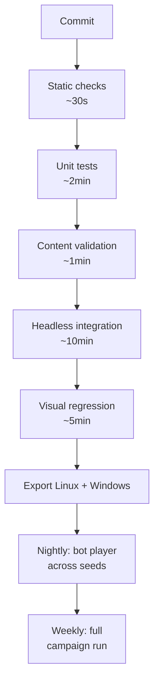

# 13 · Build, test and self-verification

[← Content manifest](12-content-manifest.md) · [Index](README.md) · [Next: The work order →](14-work-order.md)

> **Load-bearing.** This deserves as much care as any gameplay system, and the pipeline gets
> built before the game.

---

## The core problem

Whoever is building this — human or agent, alone or at 3am — **cannot see whether it is
fun by looking at the code.** It is entirely possible to produce something that compiles,
passes unit tests, and is unplayable. Every technique below exists to close that gap.

## Five layers of verification

### 1. Static checks

GDScript type checking with **full static typing enforced**, `gdlint`, and a custom
**scene-reference checker** that catches broken node paths and missing resources — the
single most common silent Godot failure — plus the JSON Schema validator over all content.

Runs in seconds on every commit. Today's equivalents already run in
[CI](../../.github/workflows/ci.yml): content validation, licence audit, repository hygiene,
documentation links, and the Python/Markdown/YAML linters.

### 2. Unit tests

gdUnit4 over pure logic: the forgery generator, rule evaluation, pricing curves, the
dependency resolver, save migration, the patch system.

**Target 80% coverage on `core/`**, which is where correctness actually matters. A change
that reduces coverage on `core/` does not merge.

### How the suite is run

The whole suite is one command, [`tools/run_tests.sh`](../../tools/run_tests.sh), and
locally it runs in sequence. CI shards it across runners instead, because every suite in
[`tests/simulation/`](../../tests/simulation) plays whole simulated days and everything else finishes in under a minute: run in
sequence they were eighteen of a twenty-minute pipeline, and sharded the pipeline is
about five.

The shards are listed in the [CI matrix](../../.github/workflows/ci.yml), and
[`tools/check_test_shards.py`](../../tools/check_test_shards.py) fails the build when a
suite file is in no shard, or in two. That check exists because hand-written shards have
exactly one dangerous failure mode: a new suite that nobody adds to the list simply stops
being run, and nothing goes red to say so.

### 3. Headless integration tests

`godot --headless` runs the real engine with the real scene tree. This is the layer that
catches what unit tests cannot:

- Boot the game, load all content, assert the registry is fully populated
- Run a full simulated day at accelerated tick rate; assert no errors, no leaks, no NaNs,
  economy within expected bounds
- Spawn one of every customer archetype and drive it through a complete encounter
- **Generate every forgery vector against every applicable document type and assert each is
  detectable by at least one available tool**
- Start a host and four clients in one process, run a scripted co-op session, assert
  convergence
- Load every mod in `tests/mods/`, **including the deliberately broken ones**, and assert
  correct failure handling

### 4. The bot player

A scripted agent that plays the game **through the same input layer a human uses**. It
shelves, prices, serves customers, renders verdicts, cooks orders, runs component checks,
feeds the cat.

It is not good at the game — **it is a liveness and progression probe.** It answers: can a full
campaign act be completed, does anything soft-lock, does the economy reach a dead end, is
any objective unreachable?

Run it nightly across many seeds, at every player count and difficulty preset. **This is the
closest available substitute for playtesting and it is worth building early rather than last.**

### 5. Visual regression

Headless rendering to image, at fixed camera positions in fixed lighting, diffed against
approved baselines. Catches missing materials, black models, broken UI layout and
z-fighting — the failures that are otherwise completely invisible to automation.

Additionally: **render every document type at inspection zoom and assert text legibility via
OCR round-trip.** If the OCR cannot read the DOB field, neither can a player.

## The pipeline

**Any red stage stops the merge. No exceptions, including for the author's own
convenience.**

## Telemetry

The game writes a structured run log on every session, human and bot: events fired,
decisions made, economy curve, time spent per loop, errors and warnings.

These answer balance questions that reasoning cannot — is the kitchen worth opening, is Act
II too long, does anybody ever buy the expensive tool. **Build the analysis tooling alongside
the game, not after.**

Telemetry is local-only and never leaves the machine without consent. That is a
[non-goal](15-risks-and-non-goals.md#explicit-non-goals-for-v10), permanently.

## What must never be done

- **Never mark a feature done because it compiles.** Done means it has an integration test
  that exercises it through the real scene tree.
- **Never disable or skip a failing test to make the pipeline green.** Fix it or revert.
- **Never leave a `TODO` in shipped content.** Stub it as an explicit, tested
  not-implemented path with a clear message.
- **Never guess at balance.** Run the bot, read the telemetry, adjust the data.
- **Never commit a change that reduces test coverage on `core/`.**

## The handoff report

At the end of the build, `HANDOFF.md` records: what was built against each specification
document, what deviates and why, known issues ranked by severity, coverage and
performance numbers, bot-player results across seeds, a licence audit summary, and **a
prioritised list of what needs human eyes first**.

Anything uncertain goes at the top — that list is the agenda for the first real play session.
